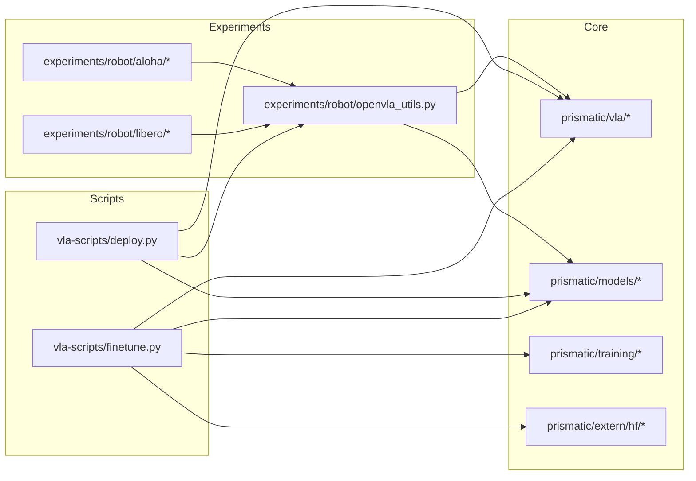
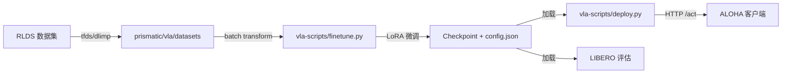

# OpenVLA-OFT 技术说明（OVERVIEW）

> 本文档基于当前仓库代码与已有说明文档进行静态分析生成。若信息不足，已标注 [需补充]。

---

## 第一部分：项目架构分析

### 1. 项目整体架构

**目录树（精简）**

```tree
openvla-oft/
├─ ALOHA.md
├─ LIBERO.md
├─ LICENSE
├─ README.md
├─ SETUP.md
├─ pyproject.toml
├─ docs/
│  └─ OVERVIEW.md
├─ experiments/
│  └─ robot/
│     ├─ openvla_utils.py
│     ├─ robot_utils.py
│     ├─ aloha/
│     │  ├─ aloha_utils.py
│     │  ├─ constants.py
│     │  ├─ preprocess_split_aloha_data.py
│     │  ├─ real_env.py
│     │  ├─ requirements_aloha.txt
│     │  ├─ robot_utils.py
│     │  └─ run_aloha_eval.py
│     └─ libero/
│        ├─ libero_requirements.txt
│        ├─ libero_utils.py
│        ├─ regenerate_libero_dataset.py
│        └─ run_libero_eval.py
├─ prismatic/
│  ├─ conf/
│  ├─ extern/
│  ├─ models/
│  ├─ preprocessing/
│  ├─ training/
│  ├─ util/
│  └─ vla/
├─ scripts/
│  └─ extern/
└─ vla-scripts/
   ├─ deploy.py
   ├─ finetune.py
   ├─ merge_lora_weights_and_save.py
   └─ extern/
```

**核心模块与职责**

- `prismatic/`：核心模型与数据管线
  - `models/`：VLM/VLA 组件（视觉骨干、LLM、动作头、投影器等）
  - `vla/`：动作 token、常量、RLDS 数据集封装
  - `training/`：训练公共逻辑与指标
  - `extern/hf/`：HF 兼容配置与模型封装
- `vla-scripts/`：训练与部署入口脚本
  - `finetune.py`：LoRA 微调训练入口
  - `deploy.py`：VLA 服务器部署（HTTP API）
- `experiments/robot/`：评估与真实/仿真机器人集成
  - `libero/`：LIBERO 仿真评估
  - `aloha/`：ALOHA 真实机器人评估
  - `openvla_utils.py`：评估与加载工具函数

**Mermaid：模块依赖关系**



**Mermaid：训练/推理数据流**



**每模块技术栈与关键依赖**

- `prismatic/`：PyTorch, Transformers, Diffusers, TensorFlow + TFDS（用于 RLDS 数据）
- `vla-scripts/`：draccus（配置注入）, torch.distributed, wandb
- `experiments/robot/`：LIBERO 仿真（libero 包），ALOHA 真实机器人依赖（详见 requirements）
- `extern/hf/`：HuggingFace 自定义配置与模型类

**Checklist**

- [ ] 目录树已覆盖核心模块
- [ ] 模块依赖与数据流图已提供
- [ ] 技术栈与关键依赖已标注

---

### 2. 模块详细说明

#### 2.1 `vla-scripts/finetune.py`

**功能描述**
- 使用 LoRA 对 OpenVLA 进行微调，支持 L1 回归与扩散式动作头。

**接口与调用关系**
- 读取 `FinetuneConfig`（draccus 参数注入）。
- 依赖 `prismatic.vla.datasets` 构建 RLDS 数据管线。
- 依赖 `prismatic.models.action_heads`、`projectors` 构建动作头/投影器。

**关键类/函数**
- `FinetuneConfig`：训练参数定义（见“训练参数配置”）
- `remove_ddp_in_checkpoint()`：去除 DDP 前缀

**配置文件说明**
- `pyproject.toml`：核心依赖与版本要求

#### 2.2 `vla-scripts/deploy.py`

**功能描述**
- 启动 VLA HTTP 推理服务，提供 `/act` 接口输出动作序列。

**接口与调用关系**
- 依赖 `experiments.robot.openvla_utils` 加载模型与处理器。
- `OpenVLAServer.get_server_action()` 接收 observation + instruction。

**关键类/函数**
- `OpenVLAServer`：封装模型加载与推理
- `DeployConfig`：推理服务参数

#### 2.3 `prismatic/vla/constants.py`

**功能描述**
- 根据命令行自动检测平台（LIBERO/ALOHA/BRIDGE）并设置动作维度、归一化等常量。

**关键点**
- `NUM_ACTIONS_CHUNK`、`ACTION_DIM`、`PROPRIO_DIM` 与平台强相关。

#### 2.4 `prismatic/vla/datasets/rlds/dataset.py`

**功能描述**
- RLDS 数据集加载、标准化、归一化与转换。

**接口与调用关系**
- `make_dataset_from_rlds()`：构建 DLataset + 统计信息
- `apply_trajectory_transforms()`：轨迹级转换（目标重标注、窗口切片等）

#### 2.5 `prismatic/models/action_heads.py`

**功能描述**
- 定义连续动作头：L1 回归、扩散噪声预测

**关键类/函数**
- `L1RegressionActionHead`
- `DiffusionActionHead`

#### 2.6 `experiments/robot/libero/run_libero_eval.py`

**功能描述**
- 在 LIBERO 仿真基准中评估策略。

**关键类/函数**
- `GenerateConfig`：评估参数
- `initialize_model()`：模型+动作头+投影器初始化

#### 2.7 `experiments/robot/aloha/run_aloha_eval.py`

**功能描述**
- 通过 VLA 服务器驱动 ALOHA 机器人执行任务。

**关键类/函数**
- `GenerateConfig`：评估参数
- `run_episode()`：单回合执行流程

**Checklist**

- [ ] 关键脚本与模块职责说明完成
- [ ] 主要接口与依赖关系已覆盖
- [ ] 关键配置入口已说明

---

### 3. 代码组织逻辑

**命名规范与组织原则**
- 训练/部署入口集中在 `vla-scripts/`。
- 评估与环境逻辑集中在 `experiments/robot/`。
- 核心库逻辑集中在 `prismatic/`。

**设计模式（基于静态推断）**
- 配置即代码：`dataclass` + draccus 参数注入。
- 组件解耦：动作头、投影器与 VLA 主体分离。
- 模型加载与 HF 兼容封装：`prismatic/extern/hf/*`。

**数据流与控制流**
- 训练：RLDS 数据 -> 标准化/归一化 -> LoRA 训练 -> 保存 checkpoint
- 推理：加载 checkpoint -> 构建处理器 -> 生成动作序列

**Checklist**

- [ ] 命名与组织原则清晰
- [ ] 设计模式已识别或标注
- [ ] 数据/控制流已说明

---

## 第二部分：快速上手指南

### 1. 环境准备

**系统要求**
- 推理：单 GPU，约 16–18GB 显存
- 训练：1–8 GPU，27–80GB 显存（bfloat16）
- Python：建议 3.10
- 依赖版本建议：PyTorch 2.2.0 + 自定义 Transformers 分支

**环境配置步骤**

```bash
# 1) 创建环境
conda create -n openvla-oft python=3.10 -y
conda activate openvla-oft

# 2) 安装 PyTorch（根据平台选择命令）
# https://pytorch.org/get-started/locally/
pip3 install torch torchvision torchaudio

# 3) 安装项目依赖
pip install -e .

# 4) 训练可选：安装 FlashAttention2
pip install packaging ninja
ninja --version; echo $?
pip install "flash-attn==2.5.5" --no-build-isolation
```

**常见问题与解决方案**
- ⚠️ ALOHA 客户端 ROS 依赖报错：
  ```bash
  conda install -c conda-forge libffi
  ```
- ⚠️ LIBERO 评估需额外安装：
  ```bash
  git clone https://github.com/Lifelong-Robot-Learning/LIBERO.git
  pip install -e LIBERO
  pip install -r experiments/robot/libero/libero_requirements.txt
  ```

**Checklist**

- [ ] Python/Conda 环境已配置
- [ ] 依赖安装完成
- [ ] 训练可选依赖已说明

---

### 2. 项目启动流程

#### 2.1 运行 LIBERO 评估

```bash
python experiments/robot/libero/run_libero_eval.py \
  --pretrained_checkpoint moojink/openvla-7b-oft-finetuned-libero-spatial \
  --task_suite_name libero_spatial
```

**参数说明**
- `--pretrained_checkpoint`：HF 模型名或本地路径
- `--task_suite_name`：libero_spatial / libero_object / libero_goal / libero_10

💡 提示：若训练使用了随机裁剪，请设置 `--center_crop True`。

#### 2.2 启动 ALOHA 推理（服务端 + 客户端）

**服务端**

```bash
python vla-scripts/deploy.py \
  --pretrained_checkpoint /PATH/TO/CHECKPOINT \
  --use_l1_regression True \
  --use_film True \
  --num_images_in_input 3 \
  --use_proprio True \
  --center_crop True \
  --unnorm_key aloha1_put_X_into_pot_300_demos
```

**客户端**

```bash
python experiments/robot/aloha/run_aloha_eval.py \
  --center_crop True \
  --num_open_loop_steps 25 \
  --use_vla_server True \
  --vla_server_url <VLA_SERVER_IP> \
  --num_rollouts_planned <NUM_ROLLOUTS> \
  --max_steps <MAX_STEPS>
```

**Checklist**

- [ ] LIBERO/ALOHA 启动命令可用
- [ ] 参数含义已说明
- [ ] 多场景示例已提供

---

### 3. 训练参数配置

**核心参数（来自 `FinetuneConfig`）**

| 参数 | 默认值 | 取值范围 | 作用 |
|---|---|---|---|
| `vla_path` | `openvla/openvla-7b` | HF 名称或本地路径 | 基座模型 |
| `data_root_dir` | `datasets/rlds` | 路径 | RLDS 数据根目录 |
| `dataset_name` | `aloha_scoop_x_into_bowl` | 字符串 | 训练数据集名 |
| `batch_size` | `8` | 正整数 | 每卡 batch size |
| `learning_rate` | `5e-4` | 正数 | 学习率 |
| `num_steps_before_decay` | `100000` | 正整数 | LR 衰减步数 |
| `max_steps` | `200000` | 正整数 | 最大训练步数 |
| `use_l1_regression` | `True` | bool | L1 动作头 |
| `use_diffusion` | `False` | bool | 扩散动作头 |
| `use_film` | `False` | bool | 语言-视觉 FiLM |
| `num_images_in_input` | `1` | 1-3 | 输入图像数量 |
| `use_proprio` | `False` | bool | 是否使用 proprio |
| `lora_rank` | `32` | 正整数 | LoRA 秩 |
| `image_aug` | `True` | bool | 图像增强 |

**常用参数模板（LIBERO）**

```bash
torchrun --standalone --nnodes 1 --nproc-per-node X vla-scripts/finetune.py \
  --vla_path openvla/openvla-7b \
  --data_root_dir /PATH/TO/RLDS \
  --dataset_name libero_spatial_no_noops \
  --run_root_dir /YOUR/RUNS \
  --use_l1_regression True \
  --use_diffusion False \
  --use_film False \
  --num_images_in_input 2 \
  --use_proprio True \
  --batch_size 8 \
  --learning_rate 5e-4 \
  --num_steps_before_decay 100000 \
  --max_steps 150005 \
  --save_freq 10000 \
  --image_aug True \
  --lora_rank 32
```

**调优建议**
- 💡 训练 L1 loss 低于 0.01 并趋于平稳后再停止。
- 💡 大数据集可延后 LR 衰减，训练更久。
- ⚠️ 训练/测试 GPU 不一致时可能显著降性能。

**Checklist**

- [ ] 训练参数表完整
- [ ] 常用模板已提供
- [ ] 调优建议已给出

---

## 第三部分：深入学习路线

### 1. 代码阅读顺序

**推荐路径**
1. [README.md](README.md)
2. [SETUP.md](SETUP.md)
3. 训练入口： [vla-scripts/finetune.py](vla-scripts/finetune.py)
4. 模型核心： [prismatic/models/action_heads.py](prismatic/models/action_heads.py)
5. 数据管线： [prismatic/vla/datasets/rlds/dataset.py](prismatic/vla/datasets/rlds/dataset.py)
6. 评估逻辑： [experiments/robot/libero/run_libero_eval.py](experiments/robot/libero/run_libero_eval.py)
7. 部署接口： [vla-scripts/deploy.py](vla-scripts/deploy.py)

**阶段目标**
- Stage 1：理解训练与评估入口参数
- Stage 2：掌握动作头与数据管线
- Stage 3：理解部署与机器人控制流

**Checklist**

- [ ] 阅读路径清晰
- [ ] 必读文件标注
- [ ] 学习目标分阶段

---

### 2. 核心概念理解

**关键术语**
- VLA：Vision-Language-Action 模型
- RLDS：Reinforcement Learning Datasets (TFDS 兼容格式)
- LoRA：低秩适配微调
- FiLM：语言条件调制视觉特征

**核心逻辑**
- VLA 将多模态输入映射到动作序列，连续动作通过动作头输出。
- RLDS 数据在训练阶段完成统一结构化与归一化。

**理论基础与参考资料**
- OpenVLA-OFT 论文：https://arxiv.org/abs/2502.19645
- 项目主页：https://openvla-oft.github.io/

**Checklist**

- [ ] 关键术语已解释
- [ ] 核心逻辑已概括
- [ ] 参考资料已提供

---

### 3. 二次开发指南

**可扩展点**
- 新动作头：扩展 [prismatic/models/action_heads.py](prismatic/models/action_heads.py)
- 新 RLDS 数据集：扩展 [prismatic/vla/datasets/rlds](prismatic/vla/datasets/rlds)
- 新评估流程：扩展 [experiments/robot](experiments/robot)

**贡献规范与流程**
- [需补充]（建议补充：分支策略、代码风格、CI 约束）

**调试技巧/测试方法**
- 使用较小数据集快速验证训练可跑通
- 固定随机种子以便复现实验
- 在评估阶段开启详细日志

**二开示例**
1. 新增一个 RLDS 数据集并接入训练：
   - 在 `prismatic/vla/datasets/rlds/oxe` 中添加配置与 transform
   - 在训练脚本中指定 `--dataset_name` 为新数据集
2. 在推理时启用扩散动作头：
   - 训练时设置 `--use_diffusion True`
   - 部署时同样设置 `--use_diffusion True`
3. 扩展 ALOHA 客户端记录更多传感器信息：
   - 在 [experiments/robot/aloha/run_aloha_eval.py](experiments/robot/aloha/run_aloha_eval.py) 中扩展 `prepare_observation()`

**Checklist**

- [ ] 二开扩展点清晰
- [ ] 贡献流程有占位说明
- [ ] 示例具备可操作性
